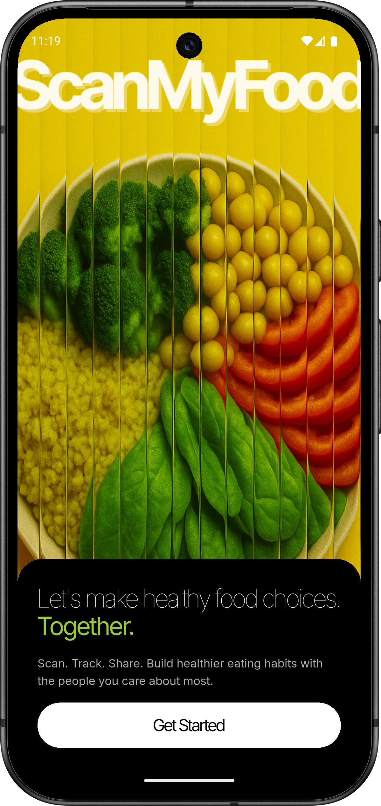
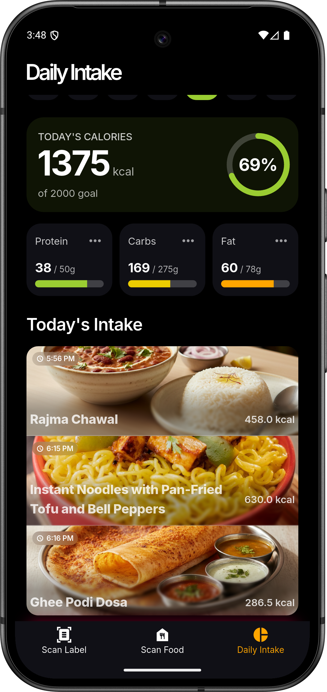
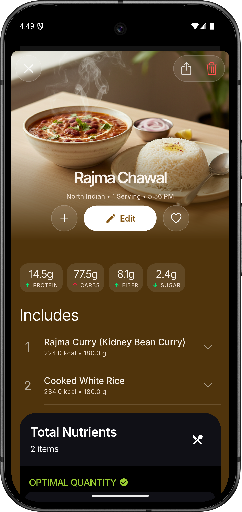
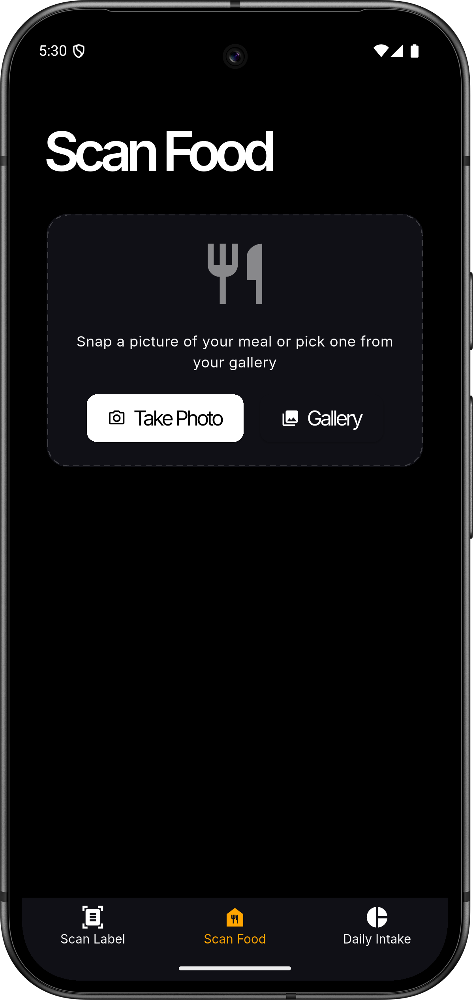
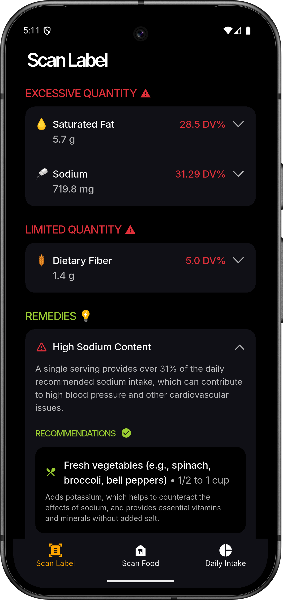
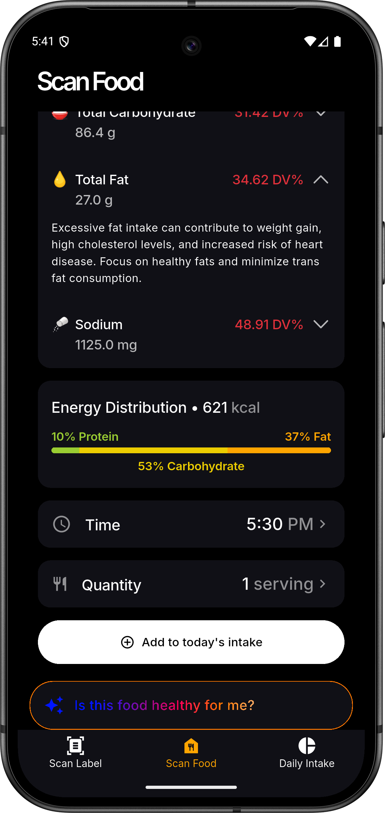
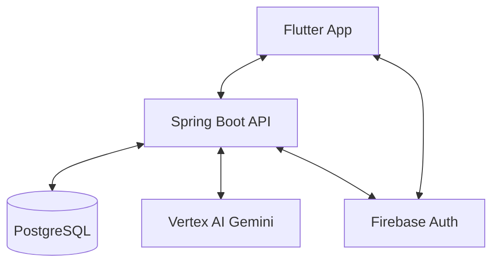

<p align="center">
  
</p>

<h1 align="center">ScanMyFood</h1>

<p align="center">
  <strong>AI-Powered Nutrition Intelligence — Know what you eat, instantly.</strong>
</p>

<p align="center">
  
  
  
  
  
  
</p>

## 📖 Overview

**ScanMyFood** is a comprehensive nutrition analysis platform designed to empower users with deep insights into their dietary habits. By combining high-fidelity mobile experience with state-of-the-art AI, we transform complex nutritional labels and meal images into actionable health data.

Built with **Flutter** and **Spring Boot**, leveraging **Google Cloud's Vertex AI (Gemini 2.0 Flash)**, ScanMyFood provides real-time analysis, historical tracking, and personalized recommendations.

## ✨ Key Features

- **📸 Intelligent Scanning**: Use your device's camera to capture product labels or entire meals.
- **🔍 AI Analysis**: Powered by Gemini 2.0 Flash for accurate nutritional extraction and food identification.
- **📊 Personalized Dashboard**: Track daily macro and micronutrient intake with beautiful visualizations.
- **📅 Nutrition History**: Maintain a comprehensive log of your consumption patterns over time.
- **👤 Health Profiles**: Tailor insights based on your specific health metrics and dietary preferences.
- **🔐 Secure Sync**: Seamless Firebase authentication and cloud-synchronized data across devices.
- **⚡ Real-time Insights**: Get instant feedback on whether a product fits your dietary goals.

## 📱 Screenshots

|                                                      |                                                          |                                                            |
| :--------------------------------------------------: | :------------------------------------------------------: | :--------------------------------------------------------: |
|  |    |  |
|   |  |     |

## 🏗️ Architecture

ScanMyFood follows a modern, decoupled architecture designed for scale and maintainability.



### Project Map

```bash
├── flutter-app/       # Mobile Frontend (Flutter/Dart)
│   ├── lib/           # Core logic, ViewModels, and UI
│   └── assets/        # Branding, Icons, and Rive Animations
└── spring-backend/    # RESTful Backend (Spring Boot/Java)
    ├── src/main/java/ # Domain logic, Services, and Controllers
    └── resources/     # Configuration and Cloud Credentials
```

## 🛠️ Tech Stack

### Frontend

- **Framework**: [Flutter](https://flutter.dev/) (MVVM Architecture)
- **State Management**: Provider
- **Visuals**: Rive (Animations), fl_chart (Data Viz)
- **Authentication**: Firebase Auth / Google Sign-In

### Backend

- **Framework**: [Spring Boot 3.5.0](https://spring.io/projects/spring-boot)
- **Database**: PostgreSQL with Spring Data JPA & MyBatis
- **AI Engine**: Google Cloud Vertex AI (Gemini 2.0 Flash)
- **Security**: Firebase Admin SDK

---

## 🚀 Getting Started

### Prerequisites

- **Flutter SDK**: `>=3.4.3`
- **JDK**: `17+`
- **Database**: PostgreSQL `14+`
- **Cloud**: GCP Project with Vertex AI enabled & Firebase Project

### 1. Backend Setup

1. Navigate to `spring-backend/`.
2. Configure `application.properties` with your PostgreSQL credentials.
3. Place your Google Cloud service account key as `firebase-service-account.json` in `src/main/resources/`.
4. Run: `./mvnw spring-boot:run`

### 2. Frontend Setup

1. Navigate to `flutter-app/`.
2. Add your `google-services.json` (Android) or `GoogleService-Info.plist` (iOS).
3. Install dependencies: `flutter pub get`
4. Run: `flutter run`

---

## 🤝 Contributing

We welcome contributions! Please follow these steps:

1. Fork the Project
2. Create your Feature Branch (`git checkout -b feature/AmazingFeature`)
3. Commit your Changes (`git commit -m 'Add some AmazingFeature'`)
4. Push to the Branch (`git push origin feature/AmazingFeature`)
5. Open a Pull Request

## 📄 License

Distributed under the MIT License. See `LICENSE` for more information.

## 💖 Acknowledgments

- [Google Vertex AI](https://cloud.google.com/vertex-ai) for the intelligence.
- [Flutter](https://flutter.dev/) and [Spring Boot](https://spring.io/) communities.
- Icons by Material Design and custom brand assets.

<p align="center">Made with ❤️ for a healthier world</p>
